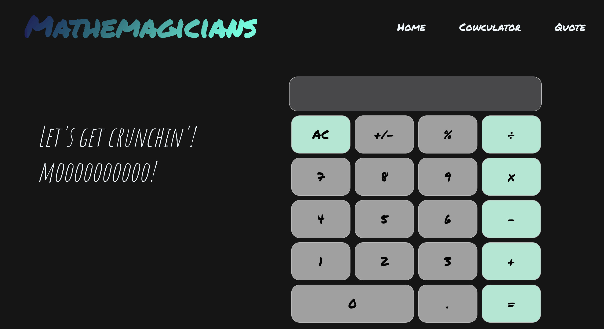

# mathemagicians

This app is a React exercise to practice using the front-end framework, React routes, and basic React styling. It includes a fully functional calculator. Have fun!

## Screenshot

## Built With

- HTML 
- CSS 
- JavaScript
- Webpack 
- React

## Live Demo

[Live Demo Link](https://danalvrz.github.io/mathemagicians/)

[Heroku Link](https://warm-stream-09966.herokuapp.com/#/)

## Getting Started

To get a local copy up and running follow the instructions.

### Setup

1. Open the terminal and clone the project using `git@github.com:danalvrz/mathemagicians.git`

### Install

1. `cd` into the project folder and run `npm install`
2. Run the command `npm start`

## Author

👤 **Dante Alvarez**

- GitHub: [@danalvrz](https://github.com/danalvrz)
- Twitter: [@danalvrz](https://twitter.com/danalvrz)
- LinkedIn: [LinkedIn](https://www.linkedin.com/in/dante-álvarez-85098a222/)

## 🤝 Contributing

Contributions, issues, and feature requests are welcome!

Feel free to check the [issues page](../../issues/).

## Show your support

Give a ⭐️ if you like this project!

## 📝 License

This project is [MIT](./MIT.md) licensed.
